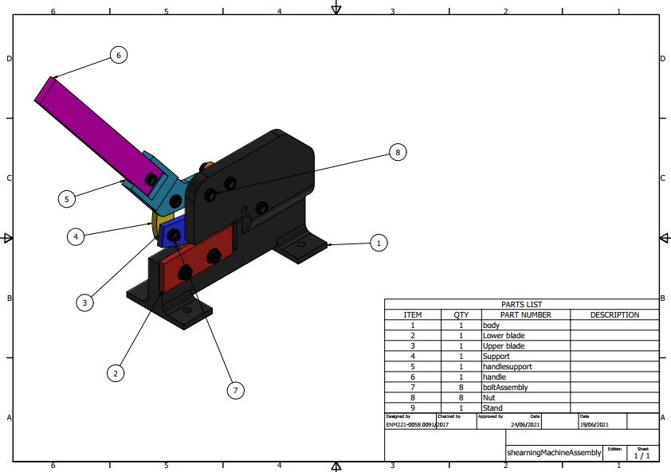

# Design of a Manual Shearing Machine - Manufacturing-Technology-1-Project

[](https://github.com/KelvinGitu/Design-of-a-Manual-Shearing-Machine/issues)


## This project is done by:

1. Kelvin Gitu ENM221-0058/2017
2. Rodney David ENM221-0091/2017

## Manual Shearing Machine

Shearing is a method for cutting materials into small pieces using a shear knife using some force. Metal plates and sheets are cut using this method. The most predominant type of shearing machine is the hydraulic shearing machine. However, most small businesses are not able to acquire such machines and thus form our purpose. Our design is a simple manual shearing machine that can be readily made in a well-equipped workshop. It is also cheap to produce and can be done in a very short time. 
A computer-aided drawing of the machine is shown below.


The assembly above consists of nine parts all of which can be produced in a workshop through processes such as turning, milling, shaping, drilling, among others. We also intend to use some of the parts from the shelves e.g bolt washer and nut. The handle might come as a rod or a tube with a rectangular cross-section from the manufacturer. This means it would have undergone some primary shaping. We would only need to surface finish it by grinding off unwanted material and painting.

## Manufacturing Processes

Primary shaping. As we had stated early some parts will come directly from the manufacturer. This includes the handle we can use a cylindrical handle or a cuboid handle. Probably it would have undergone a drawing operation.
Separation
1. Milling. This will be one of our core manufacturing processes. We can mill the remaining parts but we would prefer to use a CNC milling machine so as to achieve a high level of precision. We might use milling operations to the nut and bolt if they can not be found locally.
2. Lathe operations. The bolt washer and nut if they are not found locally we would start them off with lathe operations. These would include facing, turning, drilling, threading among others,
3. CNC Machining. Now, all the above operations can be completed in a programmable CNC machine. I guess this is our most important process. We wouldn’t discuss the advantages of CNC machining presents to use but we would rather explain some of the machining processes. We would use CNC milling to do most of our tasks. We would initially buy the billet material then place it on the milling table and program the machine to cut the specific geometry we want. Some of the parts we would mill include the Body, lower blade, upper blade, support, handle support and stand. 
4. Grinding. After machining the upper and lower blade we would grind it so as to ensure the knife edge is sharp enough. We aren’t sure if this can be done using the MasterCAM software but we are looking into it.
Joining
1. Welding. We intend to reinforce some of the bolted joints with welds specifically at the body. This is to ensure our body is rigid and has a longer life span. We aren’t sure if this can be done using the MasterCAM software but we are looking into it. We know it can be done using the Inventor CAM software.
2. Bolt and nut. This is the easiest and most convenient way to join some of our parts e.g the handle and also the blades to the body. This would provide a good joint ensuring the machining can last longer.
Coating
As our final process, we would like to paint the machine so as to increase its aesthetic appeal. We aren’t sure if this can be done using the MasterCAM software but we are looking into it.

## Presentation
Can be viewed from [here](https://prezi.com/view/DIa9HizP2NmdG6Iu90mM/)

## Project structure
```
.
├── Analysis
│   ├── 2021-07-30_22-48-34.mkv
│   ├── Images
│   │   ├── Autodesk_Logo_Black.png
│   │   ├── minus.png
│   │   ├── plus.png
│   │   └── shearningMachineAssembly.iam Stress Analysis Report 30_07_2021
│   │       └── 0
│   │           ├── Constraint_0_0.png
│   │           ├── Load_0_1.png
│   │           ├── Load_0_2.png
│   │           ├── Result_1_1.png
│   │           └── Result_1_8.png
│   ├── shearningMachineAssembly.iam Stress Analysis Report 30_07_2021.html
│   ├── Study Result.avi
│   └── Weld Bead Report.xls
├── Codes
│   ├── 1001.nc
│   ├── bodybottompart.mpf
│   ├── bodybottompart.NC
│   ├── upperblade.mpf
│   └── upperblade.NC
├── Design
│   ├── handle.dwg
│   ├── handle.ipt
│   ├── handle.pdf
│   ├── handlesupport.dwg
│   ├── handlesupport.ipt
│   ├── handlesupport.pdf
│   ├── lockfile.lck
│   ├── OldVersions
│   ├── README.md
│   ├── rendershearningMachineAssembly.png
│   ├── shearningMachineAssembly
│   │   ├── AIP
│   │   │   └── FEA
│   │   │       ├── dola00nj4.fins
│   │   │       └── Simulation.log
│   │   └── InCAD
│   │       └── FEA
│   │           ├── LICENSE.LOG
│   │           ├── pkfd50uhz.ECD
│   │           └── pkfd50uhz.OUT
│   ├── shearningMachineAssembly.dwg
│   ├── shearningMachineAssembly.iam
│   ├── shearningMachineAssembly.jpg
│   └── shearningMachineAssembly.pdf
├── MANUAL_SHEARING_MACHINE_PROJECT_REPORT.pdf
├── presentation.txt
└── README.md
```
